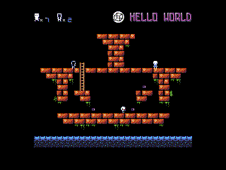

#Alter Ego port to Bitbox !

*Alter Ego* is a unique platformer based on the fact that you control an alter ego with which you wan swap position
to solve puzzle levels ! Look at video to understand gameplay.

 - Controls : Press button A to swap, D-pad to move !
 - Original game by retro souls [Homepage](http://www.retrosouls.net/?page_id=614)
 - NES port by [Shiru](http://shiru.untergrund.net/software.shtml#nes)
 - Port by Makapuf for bitbox micro, 2016

[A Video of the gameplay](https://www.youtube.com/watch?v=OLNn7vlYZLc)

